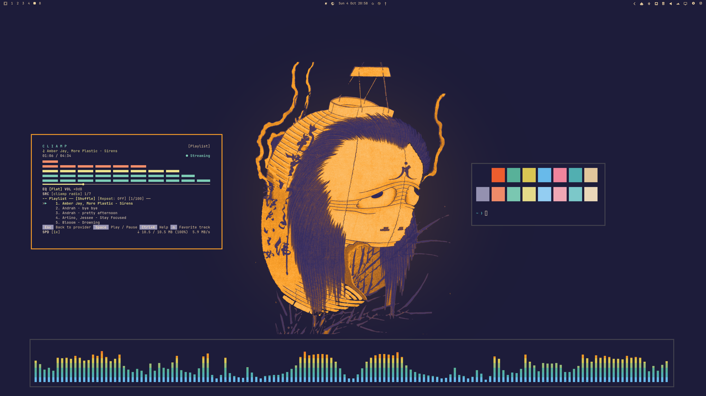
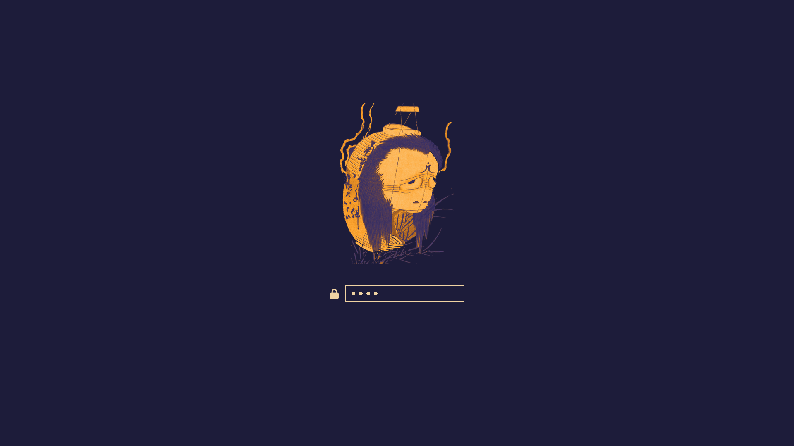
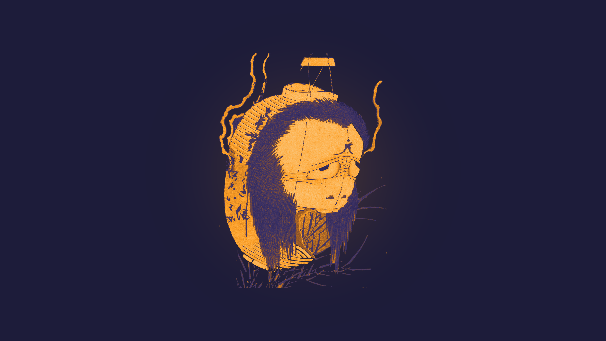
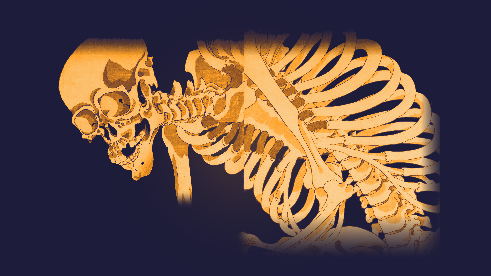
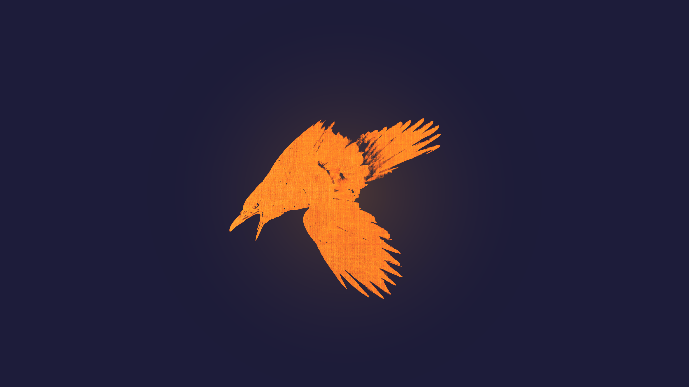

# Dusk Lantern Omarchy Theme

An Omarchy theme of paper lanterns over a koi pond at dusk, haunted by the ghosts of Edo-period woodblock prints. Dusk-indigo surfaces, lantern-lit paper text and a single lantern-amber accent carry the desktop, while each wallpaper is one figure from a public-domain print glowing out of the evening sky.

## Preview



<table>
  <tr>
    <td></td>
  </tr>
</table>

## Install

```bash
omarchy theme install https://github.com/Devis99/omarchy-dusk-lantern-theme
```

## What's Included

- Core Omarchy theme colors for Hyprland, the shell, terminals, btop, Neovim and other templated apps.
- Plymouth unlock artwork with the lantern ghost.
- Extra app themes for GTK, Vencord (Midnight), Cava and Zen.
- Yaru Purple icons.
- A 5-wallpaper set in `backgrounds/`, sources listed in `backgrounds/SOURCES.md`.
- A Base24 palette export in `dusk-lantern-base24.yaml`.

## Palette

Dusk Lantern is built from one scene: the indigo sky after sunset, a lit paper lantern, and the koi pond beneath it. The sky gives every surface, the lantern gives the one accent, and the pond gives the supporting colors: koi vermilion, lotus, pond teal, water glint and the last blue of the sky.

It is not a generic warm-on-dark palette. The ground is a tinted indigo rather than a neutral grey, there is no white anywhere, and terminal slots follow the scene instead of the rainbow: `red` is the koi, `orange` is the lantern, and `green` and `cyan` are both pond water.

## Wallpapers

All wallpapers are 3840x2160. They are cut-outs from public-domain and CC0 prints, recolored with the theme palette; the theme files themselves are MIT licensed.

<table>
  <tr>
    <td><br><sub>01 Lantern Ghost</sub></td>
    <td><br><sub>02 Skeleton Spectre</sub></td>
    <td><br><sub>03 Lantern Cat</sub></td>
  </tr>
  <tr>
    <td><br><sub>04 Moths</sub></td>
    <td><br><sub>05 Crow</sub></td>
    <td></td>
  </tr>
</table>
